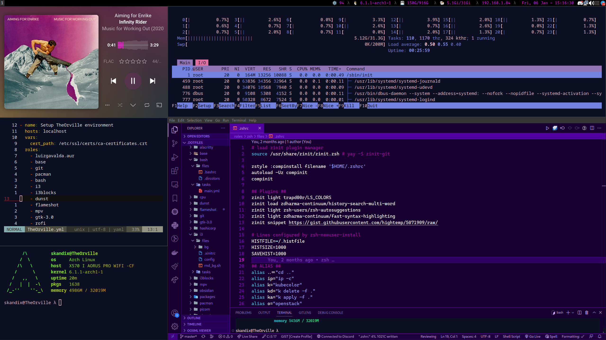
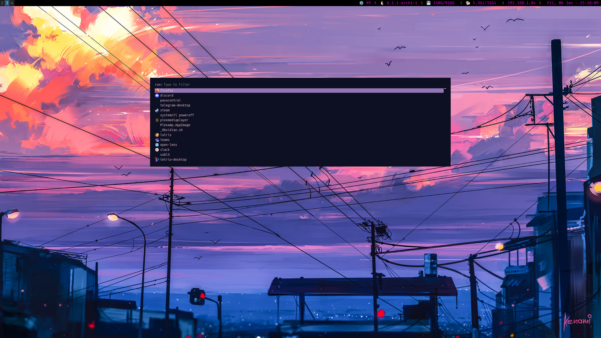

# .dotfiles
> TODO: write tagline
> 
## INSTALL
```bash
git clone https://github.com/skandix/.dotfiles.git
```

## USAGE
```bash
make help
make to|sc|ds|server
```

## SCREENSHOT
<br>






# Inspiration // Street Cred
- https://snow-dev.com/posts/next-level-dotfiles-with-ansible.html
- https://github.com/snowiow/snow
- https://github.com/bhcopeland/ansible-arch-env/blob/master/configure_pacman.yml
