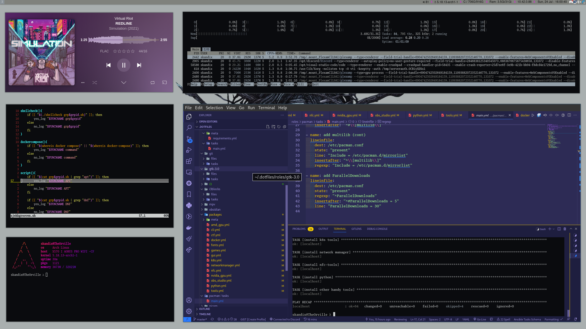

# .dotfiles




## INSTALL
```bash
git clone https://github.com/skandix/.dotfiles.git
```

## USAGE
```bash

```

# Inspiration // Street Creds
- https://snow-dev.com/posts/next-level-dotfiles-with-ansible.html
- https://github.com/snowiow/snow